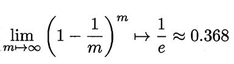
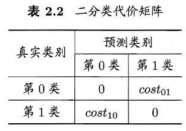

# 一、基本术语
1. 样本(sample)、示例(instance)：数据集中的数据。也可以被称为被称为**特征向量**
   1. $D={\bold{X_1},\bold{X_2},..,\bold{x_m}}$，D为数据集，$\bold{x_i}$为数据集的示例
2. 数据集需要有**属性**（也就是数据的维数），属性的取值为**属性值**。属性张成的空间被称为属性空间或样本空间
   1. 假设每个示例需要d个属性描述，那么$\bold{x_i}=(x_{i1},x_{i2},..,x_{id})，\bold{x_i}\in\chi$，其中$\chi$为d维样本空间，$x_{ij}$为第j个属性上的取值
3. 预测：
   1. 我们需要给每个样本一个标记（label）。标记构成的空间为标记空间。
      1. 比如$(\bold{x_i},y_i)$的$y_i$为标记，他们构成的的标记空间记为$\gamma$
      2. 预测任务就是希望通过对训练集$\{(\bold{x_1},y_1),...,(\bold{x_m},y_m)\}$进行学习，建立一个映射$f:\chi \rightarrow \gamma$
   2. 分类：预测离散值
      1. 二分类：只涉及两个类别的分类任务。其中一类被称为**正类**，一类为**反类**
   3. 回归：预测连续值
   4. 完成模型学习后，使用其进行预测的过程称为**测试**，被预测的样本称为**测试样本**
4. 聚类
   1. 对训练集进行分组。训练集一般没有label
5. 泛化：保证模型不仅在原数据集表现良好，还要让其能够适应新样本
   1. 一般而言，训练集如果能很好反映样本空间的特性，那么他的泛化能力就可以很强。所以我们要让样本数据集满足**独立同分布**，即每个样本都是独立地从这个样本空间满足的分布上采样获取的
6. 假设空间
   1. 学习过程可以被视为在一个所有假设组成的空间中搜索的过程，搜索目标是找到和训练集相匹配的假设。对于预测问题，不同属性的取值组合导致的不同label构成了我们的假设空间
   2. 学习过程是基于有限样本训练集进行，因此可能有多个假设与训练集一致。这些**假设集合**被称为**版本空间**。比如下面西瓜问题，我们要筛选好瓜，好瓜这个问题的版本空间如图1.2： 
7. 归纳偏好
   1. 版本空间经常出现多个假设，此时我们如果选取不同的假设，那么模型对于好瓜的判断也会不同
   2. 因此，我们在训练模型时需要规定**偏好**。比如我们喜欢复杂的条件，那么我们就会认为(*,蜷缩,清脆)的瓜才是好瓜。这种偏好也叫**归纳偏好**
   3. 奥卡姆剃刀原则就是我们常用的偏好。所以下图中A线的拟合明显比B好：
   4. NFL理论（"没有免费的午餐"定理）
      1. 不同偏好不可能永远套在所有情况，所以我们也无法说算法A($\zeta_a$)永远比算法B(($\zeta_b$)好
      2. 不同偏好产生的算法，总误差在数学上期望是相同的。证明如下：
      3. 假设样本空间$\chi$和假设空间组H都是离散的。令$P(h|X, \zeta_a)$代表算法乌基于训练数据X产生假设h的概率，再令f代表我们希望学习的真实目标函数。$\parallel(·)$表示二值函数，内部值为真取1，否则取0。那么算法$\zeta_a$表示的训练集外的误差为：$E_{ote}(\zeta_a|X,f)=\sum_h \sum_{\bold{x}\in \chi-X}P(\bold{x})\parallel (h(\bold{x})\neq f(\bold{x})) P(h|X,\zeta_a)$
      4. $\sum_f E_{ote}(\zeta_a|X,f)=\sum_f \sum_h \sum_{\bold{x}\in \chi-X}P(\bold{x})\parallel (h(\bold{x})\neq f(\bold{x})) P(h|X,\zeta_a)=\sum_f{\parallel (h(\bold{x})\neq f(\bold{x}))} \sum_h{P(h|X,\zeta_a)} \sum_{\bold{x}\in \chi-X}{P(\bold{x})}=\sum_f{\parallel (h(\bold{x})\neq f(\bold{x}))}*1*\sum_{\bold{x}\in \chi-X}{P(\bold{x})}=\frac{1}{2}2^{|\chi|}\sum_{\bold{x}\in \chi-X}{P(\bold{x})}$
      5. 这说明我们算法最后的总误差并不取决于算法的选择，而是数据集合样本空间的差异
      6. 解释一下二值函数的求值：
         1. 首先要知道此时我们对f的假设是任何能将样本映射到{0,1}的函数且服从均匀分布
         2. 假设样本空间只有两个样本时，那么该二值函数可能出现的所有映射情况为： ，即函数有$2^{|\chi|}=2^2=4$种情况。
         3. 通过算法$\zeta_a$得出的模型$h(\bold{x})$永远有一半0一半1（比如$f_1$对$\bold{x_1}$时，是2个0，2个1）。
         4. 因此，我们得到：$\sum_f{\parallel (h(\bold{x})\neq f(\bold{x}))}=\frac{1}{2}2^{|\chi|}$
      7. NFL并不是说求最好的算法没意义，因为现实情况下，问题不会出现的概率相同，问题也不可能同等重要。因此根据具体问题判断算法偏好很重要

# 二、模型评估
1. 误差
   1. 错误率：错误样本数占总样本数的比例
   2. 精度：1-错误率
   3. 误差：模型的预测与真实值的差别
   4. 训练误差（经验误差）：训练集上的误差
   5. 泛化误差：在新样本上的误差。泛化误差越小越好
2. 过拟合
   1. 当模型把样本中一些非一般特性都学习到，就会发生过拟合
   2. 大多数机器学习都是NP问题，很难找到全局最优解
3. 测试集：
   1. 对模型泛化误差进行评估的数据集，要保证与训练集互斥
   2. 留出法：
      1. 将数据集D划分为两个互斥的集合，一个为训练集，一个为测试集
      2. 划分时要保证数据分布的一致性。因此我们一般使用**分层采样**。例如通过对D 进行分层采样而获得含70% 样本的训练集S 和含30% 样本的测试集T， 若D包含500个正例、500 个反例，则分层采样得到的S应包含350 个正例、350 个反例，而T则包含150个正例和150 个反例;
      3. 使用该方法时，要采用若干次随机划分，对每次产生的划分都进行测试，准确率是这些测试结果的平均值。切忌只进行一次划分
      4. 如果训练集和测试集的规模大小有很大差别，这样训练出来的模型与真实模型可能会有很大误差，降低了**保真性**
      5. 因此训练集一般占总样本的2/3~4/5即可
   3. 交叉验证法
      1. 先将数据集D划分为k个大小相似的互斥子集，每个子集保证数据分布的一致性，所以我们使用分层采样
      2. 每次用k-1 个子集的并集作为训练集，余下的那个子集作为测试集;这样就可获得k组训练/测试集，从而可进行k 次训练和测试，最终返回的是这k个测试结果的均值
      3. k 最常用的取值是10 ，此时称为10折交叉验证
      4. k 折交叉验证通常要随机使用不同的划分重复p次，最终的评估结果是这p次k折交叉验证结果的均值
      5. 留一法：假定数据集D中包含m个样本，若令k=m，则得到了交叉验证法的一个特例:留一法
   4. 自助采样：
      1. 对于m个样本的数据集D。我们每次从中有放回地随机挑选数据，重复m次，组成新数据集D'。用D'和D取交集，相交的部分作为训练集，两个集合之差作为测试集
      2. D中数据不被采集到的概率： 
      3. 这种方法改变了数据的初始分布，只适用于小样本数据
4. 调参
   1. 我们设定的参数对模型训练有很大影响，但是在实数域这种大范围尝试是不现实的。因此在调参时我们是对每个参数选定一个范围和变化步长
   2. 例如在[0,0.2] 范围内以0.05 为步长，则实际要评估的候选参数值有5 个，最终是从这5 个候选值中产生选定值.
   3. 当我们模型能稳定通过测试集，调参完毕，此时我们需要把模型在整个数据集D上再训练一遍。这样的模型才是我们最终要进行应用的模型
5. 验证集
   1. 我们需要把训练集划分为训练集与验证集。验证集用来辅助我们进行快速调参
   2. 好处：
      1. 可以及时发现模型或者参数的问题。比如模型在验证集上发散
      2. 验证模型的泛化能力，如果在验证集上的效果比训练集上差很多，就该考虑模型是否过拟合了
6. 度量性能
   1. 错误率：错误样本数占总样本数的比例
   2. 精度:1-错误率
   3. 均方误差：$E(f;D)=\frac{1}{m}\sum_{i=1}^m(f(\bold{x_i})-y_i)^2$。连续形式：$E(f;D)=\int_{\bold{x} \sim D}{(f(\bold{x_i})-y_i)^2p(\bold{x})d\bold{x}}$
   4. 查准率与查全率： 
      1. 查准率：正例的正确率是多少$P=\frac{TP}{TP+NP}$
      2. 查全率：是否把所有正例找出$R=\frac{TP}{TP+FN}$
      3. 一般来说，查准率高时，查全率往往偏低
      4. PR曲线：  若一个学习器的P-R 曲线被另一个学习器的曲线完全"包住"，则可断言后者的性能优于前者，比如该图中A优于C
      5. 平衡点（BEP）：综合考虑不同学习器的查全率与查准率。它是" 查准率=查全率"时的取值。BEP越大，学习器越优
      6. F1度量：比BEP更好地度量模型的质量 
      7. $F_{\beta}$：F1的一般形式。
         1. 能让我们表达出对查准率/查全率的不同偏好
         2.  要求$\beta >0$
         3. $\beta =1$时退化为标准的F1; $\beta >1$时查全率有更大影响; $\beta <1$时查准率有更大影响
      8. 多个混淆矩阵时的情况
         1. 我们一般为了指标的准确性，会把不同划分的数据集都计算一个混淆矩阵，然后综合他们的结果去考察P和R
         2. “宏”定义法：先在各混淆矩阵上分别计算出查准率和查全率，记为($P_1$,$R_1$)，($P_2$,$R_2$) ，...，($P_n$,$R_n$)，再计算平均值 
         3. “微”定义法：先将各泪淆矩阵的对应元素进行平均，得到TP 、FP 、TN 、FN 的平均值，再基于这些平均值计算出相应指标 
   5. ROC与AUC
      1. 很多学习器是为测试样本产生一个实值或概率预测，然后将这个预测值与一个分类阔值(threshold)进行比较，若大于阈值则分为正类，否则为反类
      2. 根据这个实值或概率预测结果，我们可将测试样本进行排序，"最可能"是正例的排在最前面，"最不可能"是正例的排在最后面
      3. 在不同的应用任务中，我们可根据任务需求来采用不同的截断点，例如若我们更重视"查准率"，则可选择排序中靠前的位置进行截断;若更重视"查全率"，则可选择靠后的位置进行截断
      4. ROC：受试者工作特征
         1. ROC 曲线的纵轴是"真正例率" (True Positive Rate，简称TPR) ，横轴是"假正例率"，即反例被预测为真例的概率 (False PositiveRate，简称FPR) 
         2. AUC：比较ROC下面的面积是一个判断学习器优劣的办法。这部分的面积被称为AUC
         3. 估计ROC：  把分类阔值设为最大，即把所有样例均预测为反例，此时真正例率和假正例率均为0 ， 在坐标(0， 0) 处标记一个点然后，将分类阐值依次设为每个样例的预测值，即依次将每个样例划分为**正例**，剩下的部分为**反例**
         4. 估计AUC：
            1. 假定ROC 曲线是由坐标为${(X_1 ， y_1), (X_2, Y_2) , . . . , (x_m, Y_m)}$的点按序连接而形成$(x_1 =0, x_m = 1)$。
            2. $AUC=\frac{1}{2}\sum_{i=1}^{m-1}{(x_{i+1}-x_i)(y_i+y_{i+1})}$ 
         5. ROC曲线上方的面积：损失
            1. 给定$m^+$个正例和$m^-$个反例令$D^+$ 和$D-$分别表示正、反例集合
            2. 损失函数： 
            3. 考虑每一对正、反例,若正例的预测值小于反例，则扣一分，正例预测值等于反例，扣0.5分   可以这么理解：当阈值为0，那么y和x都是1，当阈值提升，图片中先是x变小，为红线，此时$\parallel (f(x^+)<f(x^-))+\frac{1}{2} \parallel (f(x^+)=f(x^-))$ (式1) 不会有增加，仍是0（因为阈值提升，被剔除的假正例肯定是数值较小的）。但是当阈值提高，y轴下降，也就是绿线，此时出现了符合式4的情况。蓝线就是正例和反例同时增加。
            4. $AUC=1-l_{rank}$
   6. 代价的度量
      1. 这里我们假设1为正，0为反
      2. 非均等代价：不同类型的错误所造成的后果不同。比如我们把患者误诊为健康人和把健康人误诊为患者是不同的错误，但是代价却完全不同。因此我们需要在不同的问题下，给错误给不同的cost，以衡量错误大小
      3. 代价矩阵：使用$cost_{ij}$衡量将第i类识别为j类的代价。一般$cost_{ii}=0$ 。如果每个cost的值不相同，那么就是**非均等代价问题**
      4. 引入代价之后的错误率计算： 
      5. 代价曲线：非均等代价问题中，无法使用ROC曲线直接反映出学习器的期望总体代价，而是要引入代价曲线
         1. $p=\frac{m^+}{(m^+ + m^-)}$
         2. 正例概率的代价： 。 分子衡量了正例错误所付出代价的极限。这个分母最极限的情况，即假设所有正例都是错的，所有反例都是对的。这个保证了我们接下来要说的P和Cost一定不会大于1。
         3. 归一化代价函数：这个的分子才是真实付出的代价  等价转化为： $cost_{norm}=FNR*P(+)+FPR*(1-P(+))$
         4. 其中FPR 是假正例率，FNR=1-TPR是假反例率。在代价平面上画一条从(0,FPR)到(1,FNR)的线段，线段下面的面积代表该条件下的期望总体代价。把ROC曲线上所有点对应的代价平面线段画出来，所有线段围成的下界就是在所有条件下学习器的期望总体代价
         5. 当P(+)=0，说明没有正例的概率，此时$cost_{norm}=FPR$，当P(+)=1，$cost_{norm}=FNR
         6. 图像：其实就是曲线$cost_norm=FNR*P(+)+FPR*(1-P(+))$，阴影部分就是他的积分。  
   7. 比较检验：我们如何对比不同学习器的性能度量结果
      1. 基于假设检验结果我们可推断出，若在测试集上观察到学习器A比B 好，则A的泛化性能是否在统计意义上优于B ，以及这个结论的把握有多大
      2. 我们从样本上得出的错误率$\epsilon'$和学习器的泛化错误率$\epsilon$有差距，因此我们需要得出学习器$\epsilon=\epsilon'$的概率有多大，从而评估模型是否合格
      3. 二项检验：适用于一次留出法
         1. 设样本总量为m，那么被分类错误的数量为$\epsilon' \times m$
         2. 那么错误率为$\epsilon'$的概率为：$P(\epsilon=\epsilon')= \binom{m}{\epsilon' \times m} \epsilon^{\epsilon' \times m} (1-\epsilon)^{m-\epsilon' m}$。对P求导$\frac{\partial P}{\partial \epsilon}=0$，所以当$\epsilon=\epsilon'$，P有最大值
         3. 该概率符合二项分布，此时我们可以使用二项检验：该图为$\epsilon=0.3$时的分布图，横轴是$m_0=\epsilon' \times m$ 
         4. 规定一个显著度$\alpha$
         5. 优化方程如下：即考虑假设$\epsilon \leq \epsilon_0$下，如果可以通过假设，则在1-$\alpha$置信度下我们可以接受这个学习器。
         6. $\bar{\epsilon}$最优化方程为：该例中为$\epsilon_0=0.3$ 
         7.  如果此时$\epsilon' \leq \bar{\epsilon}$，那么证明假设成立，在$1-\alpha$的置信度下，$\epsilon \leq \epsilon_0$无法被拒绝。因此在图中可以看到阴影部分为拒绝域。接受域中对应的$\epsilon'$都可以被接受
      4.  t检验：适用于多次留出法、交叉验证法等测试次数大于1的数据分割方法
          1. 假定我们得到了k个测试错误率：$\hat{\epsilon_1},\hat{\epsilon_2},...,\hat{\epsilon_k}$，期望和方差为 
          2. 假设：$\mu = \epsilon_0$
          3. 求如下指标： 。他的t分布为： 
          4. 如果$tau$的值小于t值边界，那么接受原假设，否则拒绝
      5.  交叉t检验：
          1. 假设：学习器A和学习器B对应的错误率应该相同。$\epsilon_i^A=\epsilon_i^B$
          2. 
      6.  McNemar检验
      7.  Friedman检验和Nemenyi后续检验
   8. 偏差和方差