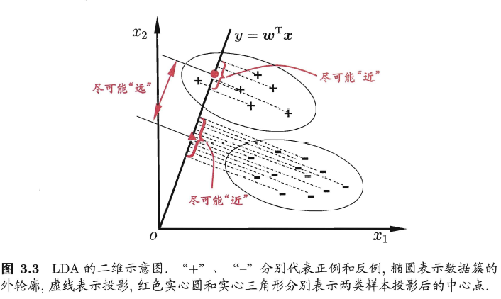
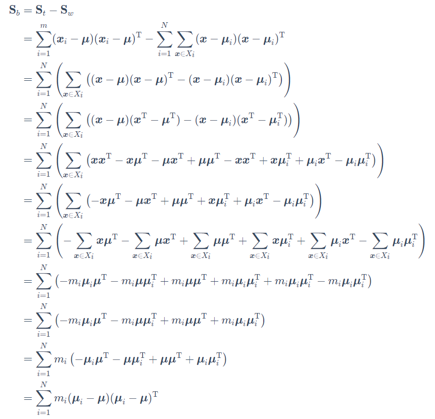
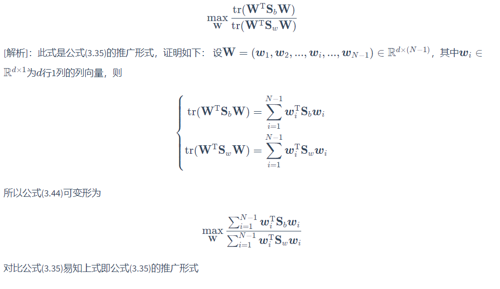
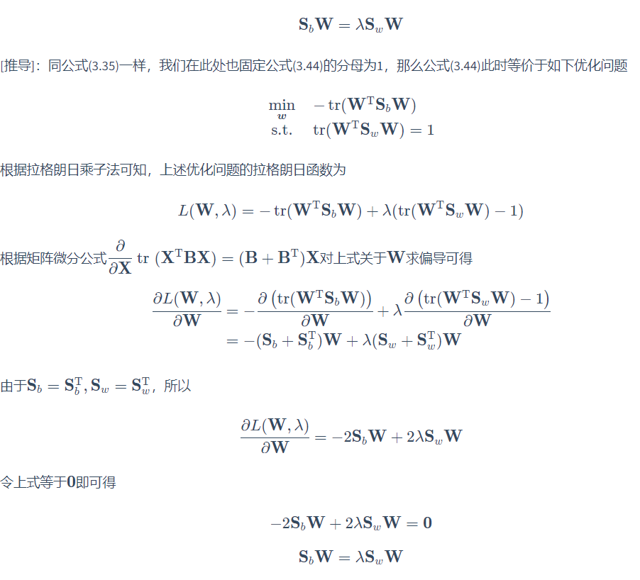
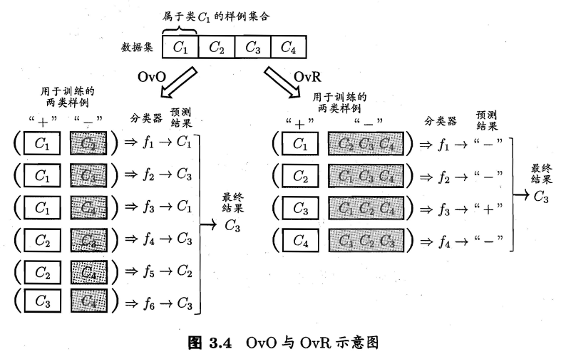
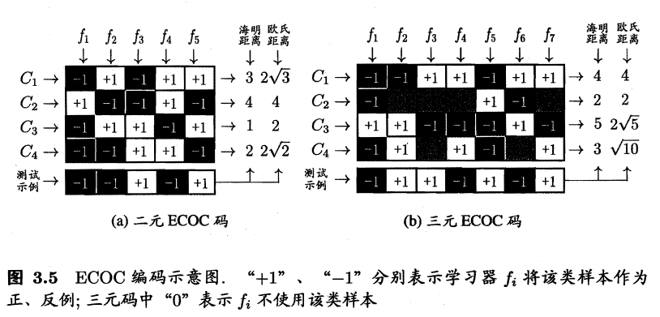
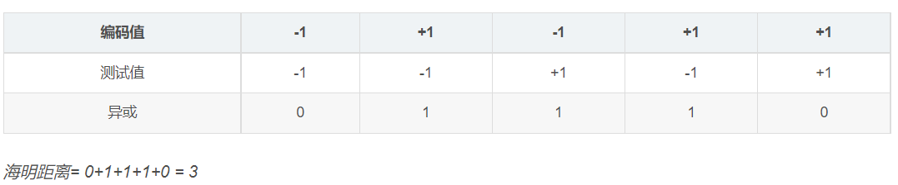

1. 线性模型的基本形式$f(\bold{x})=\bold{w^T x}+b$
# 一、线性回归
1. 给定数据集$D={(\bold{x_i},y_i)} i=1,2,...$，其中$\bold{x_i}=(x_{i1},...,x_{id})$，$y_i \in \mathbb{R}$
2. 最优化任务：$f(\bold{x_i})=\bold{w^T x_i}+b_i$，使得$f(\bold{x_i}) \approxeq y_i$
3. OLS估计：
   1. 设估计的参数为$\bold{\hat{w}}=(\bold{w},b)$
   2. 数据集$D_{x,d+1}=\left[ \begin{matrix}
       x_{11}&x_{12}& \cdots & x_{1d}&1 \\
       x_{21}&x_{22}& \cdots &x_{2d}&1 \\
       \vdots&\vdots&\cdots&\vdots&\vdots\\
       x_{m1}&x_{m2}&\cdots&x_{md}&1
        \end{matrix}\right] 
        = \left[ \begin{matrix}
        \bold{x_1^T}&\bold{1}\\
        \bold{x_2^T}&\bold{1}\\
        \vdots&\vdots\\
        \bold{x_m^T}&\bold{1}
        \end{matrix}\right]$
    3. 我们的优化任务：$\bold{\hat{w}}=arg_{\bold{\hat{w}}} min(\bold{y-\bold{D}\hat{w}})^T(\bold{y-\bold{D}\hat{w}})$。令$E_{\hat{w}}=(\bold{y-\bold{D}\hat{w}})^T(\bold{y-\bold{D}\hat{w}})$，当$\frac{\partial{E_\bold{{\hat{w}}}}}{\partial{\bold{\hat{w}}}}=2 \bold{D^T(D\hat{w}-y)}=0$，有$\hat{\bold{w}}$的极值。
    4. 当$\bold{X^TX}$满秩或者正定，可得解$\bold{\hat{w}}=(\bold{X^TX})^{-1}X^Ty$
4. 正则化
   1.  现实中，很多时候我们会遇到属性多于样例个数或者是其他的情况，导致$\bold{X^TX}$无法满秩，这时我们会解出多个$\bold{\hat{w}}$使均方误差最小化，因此我们需要引入学习算法的归纳偏好。正则化就是最常见的一个方法
   2.  正则化的本质就是对某一问题加以先验的限制或约束以达到特定目的的一种手段或操作。会在第6章和第11章详细介绍
5.  广义线性模型
    1.  考虑单调可微函数$g(·)$，令$y=g^{-1}(\bold{w^T}+b)$，这就是广义线性模型的形式。形似这样的函数都可以化成线性回归模型
    2.  比如对数线性回归$lny=\bold{w^T}+b$，实际上就是$y=e^{\bold{w^T}+b}$到线性空间的映射，$g(·)=ln(·)$
# 二、对数几率回归：分类任务
1. 我们做线性回归时，回归值都是连续实数，这不利于我们去做分类任务。
2. 单位阶跃函数：对回归出来的值做映射：$z=\left \{\begin{matrix}0 , y<0 \\ 0.5, y=0 \\ 1, y>0
\end{matrix}\right.$
3. Sigmoid：单位阶跃函数不连续，无法作为广义线性模型，所以我们一般使用对数几率函数sigmoid：
   1. $y=\frac{1}{1+e^{z}}=\frac{1}{1+e^{-(\bold{w^T}+b)}}$
   2. 可以变化为$ln \frac{y}{1-y}=\bold{w^Tx}+b$
   3. 如果y为正例可能性，那么1-y就是反例的可能性。他们比值的对数进行回归就构成了对数几率函数Sigmod
   4.  优点
       1.  该模型无需事先假设数据分布
       2.  它不是仅预测出"类别"，而是可得到近似概率预测，这对许多需利用概率辅助决策的任务很有用
       3.  对率函数是任意阶可导的凸函数，有很好的数学性质，现有的许多数值优化算法都可直接用于求取最优解
   5.  回归方法：
       1.  重写回归函数为：$ln \frac{p(y=1|\bold{x})}{p(y=0|\bold{x})}=\bold{w^Tx}+b$，此时$p(y=1|\bold{x})=\frac{e^{(\bold{w^T}+b)}}{1+e^{(\bold{w^T}+b)}};p(y=0|\bold{x})=\frac{1}{1+e^{(\bold{w^T}+b)}}$
       2.  合并p:
           1.  令$\bold{\beta}=(\bold{w};b),\hat{\bold{x}}=(\bold{x};1)$
           2.  $p_1(\hat{\bold{x}};\bold{\beta})=p(y=1|\hat{\bold{x}};\bold{\beta})$，$p_0(\hat{\bold{x}};\bold{\beta})=p(y=0|\hat{\bold{x}};\bold{\beta})=1-p_1(\hat{\bold{x}};\bold{\beta})$
           3. $p(y_i|\hat{\bold{x}};\bold{\beta})=y_ip_1(\hat{\bold{x}};\bold{\beta})+(1-y_i)p_0(\hat{\bold{x}};\bold{\beta})$
        3. 极大似然法求参数
           1. $L(\bold{\beta})=\sum^m_{i=1}lnp(y_i|\hat{\bold{x}};\bold{\beta})=\sum^m_{i=1}(y_i\bold{\beta^T\hat{x_i}}+ln(1+e^{\bold{\beta^T\hat{x_i}}}))$。
           2. 求解这个似然函数的最大值得参数$\bold{\beta^*}=arg_{\bold{\beta}}maxL$
           3. 求解方法
              1. 梯度下降
              2. 牛顿迭代：$\beta^{t+1}=\beta^t-(\frac{\partial^2{L}}{\partial{\bold{\beta}}\partial{\bold{\beta^T}}})^{-1}\frac{\partial{L}}{\partial{\bold{\beta}}}$
# 三、线性判别分析（LDA）
1. 基本思想：
   1. 给定训练样例集，设法将样例投影到一条直线上，使得同类样例的投影点尽可能接近、异类样例的投影点尽可能远离
   2. 在对新样本进行分类时，将其投影到同样的这条直线上，再根据投影点的位置来确定新样本的类别 
2. 给定数据集$D={(\bold{x_i},y_i)}^m_{i=1},y_i \in {0,1},、X_i、\bold{\mu_i}(即各个属性值的均值)、\bold{\Sigma_i}$分别为第$i \in {0,1}$类示例的集合、均指向了和协方差矩阵
   1. 给定直线为$\bold{y=w^Tx}$
   2. 两类样本的中心在直线上投影为：$\bold{w^T \mu_0}$和$\bold{w^T \mu_1}$
   3. 两类样本点投影到直线后协方差为$\bold{w^T\Sigma_0w}$和$\bold{w^T\Sigma_1w}$
3. 最优化
   1. 使同样例投影点尽量靠近：$min(\bold{w^T\Sigma_0w}+\bold{w^T\Sigma_1w})$
   2. 使不一样的投影点尽量远离：$max \parallel \bold{w^T \mu_0}-\bold{w^T \mu_1} \parallel^2_2$。其中$\parallel \parallel^2_2$是范数的记号，表示2范数的平方。p-范数定义为$\parallel x \parallel_p=(\sum_{i=1}^n|x_i|^p)^{\frac{1}{p}}$，因此2范数实际为$\parallel x \parallel_2=(\sum_{i=1}^n|x_i|^2)^{\frac{1}{2}}$
   3. 因此得到最优化目标：$J=\frac{\parallel \bold{w^T \mu_0}-\bold{w^T \mu_1} \parallel^2_2}{\bold{w^T\Sigma_0w}+\bold{w^T\Sigma_1w}}=\frac{\parallel \bold{w^T (\mu_0-\mu_1)} \parallel^2_2}{\bold{w^T\Sigma_0w}+\bold{w^T\Sigma_1w}}=\frac{(\bold{w^T (\mu_0-\mu_1)})^T\bold{w^T (\mu_0-\mu_1)}}{\bold{w^T\Sigma_0w}+\bold{w^T\Sigma_1w}}=\frac{\bold{w^T(\mu_0 -\mu_1)(\mu_0-\mu_1)^Tw}}{\bold{w^T(\Sigma_0w+\Sigma_1)w}}$
   4. 内类散度矩阵：实际上和协方差矩阵含义一致，协方差矩阵乘$\frac{1}{n-1}就是协方差矩阵$
   5. 定义内类散度矩阵：$\bold{S_w=\Sigma_0+\Sigma_1}$
定义类间散度矩阵$\bold{S_b=(\mu_0 -\mu_1)(\mu_0-\mu_1)^T}$

   6. 广义瑞利商：最优化目标可以化成广义瑞利商的形式$J=\frac{\bold{w^TS_bw}}{\bold{w^TS_ww}}$。我们将根据这个求解w
      1. 关于w的最优化：
      $\begin{aligned}
          \min \limits_{w} \bold{-w^TS_bw}\\
      s.t. \bold{w^TS_ww}=1
      \end{aligned}$
      1. 使用拉格朗日乘子法，对$\bold{w}$求导可得$\bold{S_bw=\lambda S_ww}$
      2. $\bold{S_bw=(\mu_0-\mu_1)(\mu_0-\mu_1)^Tw}=(\bold{\mu_0-\mu_1})\gamma$，所以$\bold{w}=\frac{\gamma}{\lambda}\bold{S_w^{-1}(\mu_0-\mu_1)}$
      3. 一般为了数值解的稳定性，所以我们不会直接求逆，而是进行奇异值分解，即$S_w=U\Sigma V^T$，$\Sigma$是一个实对角矩阵，然后我们对这个实对角矩阵求逆，然后根据$\bold{S_w^{-1}=V\Sigma^{-1} U^T}$求$S_w^{-1}$
   7. 当两类数据同先验、满足高斯分布且协方差相等时，LDA可达到最优分类
   8. 推广到多分类任务
      1. 假定存在N个类，并且第i类示例数为$m_i$
      2. 全局散度矩阵（即全局的协方差）：$\bold{S_t=S_b+S_w=\sum^m_{i=1}(x_i-\mu)(x_i-\mu)^T}$
      3. 每个类别的散度矩阵为$\bold{S_w=\sum^N_{i=1}S_{w_i}}$，$\bold{S_{w_i}=\sum \limits_{x \in X_i}(x-\mu_i)(x-\mu_i^T)}$
      4. 类间散度矩阵为： 
      5. 优化目标：$\max \limits_{\bold{w}}\frac{tr(\bold{W^TS_bW})}{\bold{tr(W^TS_wW)}}$，其中$\bold{W}\in \mathbb{R}^{d \times (N-1)}$ 
      6. 依然使用拉格朗日求解： 
      7. W的闭式解（解析解）：解这个拉格朗日方程就是广义特征值求解问题，这里我们不做展开，我们只需要记住，$\bold{W}$的数值解是$\bold{S^{-1}_wS_b}的N-1个最大广义特征值所对应的特征向量组成的矩阵$
      8. 如果将$\bold{W}$视为一个投影矩阵，那么多分类LDA将样本投影到N-1维空间，并且N-1要远小于原本属性数，所以多分类LDA被视为一种**监督降维技术**

# 四、多分类学习
1. 多分类学习的基本思路是“拆解法”，即将多分类任务拆为若干个二分类任务求解
2. 拆分策略：假设原本数据集有N类
   1. 一对一（OvO）：将这N个类别两两配对，从而产生N(N-1)/2个二分类任务。最后把要测试的数据扔到这些分类器中，投票产生最后的分类结果
   2. 一对其余（OvR）：每次将一个类的样例作为正例，所有其他类的样例作为反例来训练N个分类器。在测试时若仅有一个分类器预测为正类，则对应的类别标记作为最终分类结果 
   3. 多对多（MvM）：每次将若干个类作为正类，若干个其他类作为反类。正、反类构造必须有特殊的设计，不能随意选取。
      1. 纠错输出码（ECOC）：最常用的MvM分类构造。ECOC 编码对分类器的错误有一定的容忍和修正能力
         1. 对N个类别做M次划分， 每次划分将一部分类别划为正类，一部分划为反类，从而形成一个二分类训练集;这样一共产生M 个训练集，可训练出M个分类器
         2. M 个分类器分别对测试样本进行预测，这些预测标记组成一个编码.将这个预测编码与每个类别各自的编码进行比较，返回其中距离最小的类别作为最终预测结果
      2. 编码矩阵：ECOC常用的编码技术
         1. 二元码：将每个类别分别指定为正类和反类
         2. 三元码：将每个类别分别指定为正类、反类和停用类
         3. 示例： 
            1. 海明距离：以二元ECOC码为例。测试样例和$C_1$的海明距离计算如下 。三元ECOC中，海明距离计算不取异或，而是规定：+1和-1的海明距离为1，+1/-1 和 0 的海明距离记为0.5
            2. 欧式距离：以二元ECOC码为例，对于C1，欧氏距离=$\sqrt{0+4+4+4+0}=2\sqrt{3}$
      3. 对同等长度的编码，理论上来说，任意两个类别之间的编码距离越远，则纠错能力越强。在码长较小时可根据这个原则计算出理论最优编码。然而，码长稍大一些就难以有效地确定最优编码，事实上这是NP难问题
      4. 并不是编码的理论性质越好，分类性能就越好，因为机器学习问题涉及很多因素。比如不同拆解方式所形成的两个类别子集的区分难度往往不间即其导致的二分类问题的难度不同

# 五、类别不平衡问题
1. 如果我们的样本中类别不平衡，那么训练出来的学习器往往没有价值。比如有998个反例，但是只有2个正例的样本不具有学习价值
2. 再放缩：代价敏感学习的基础
   1. 类别比较平衡时，我们常常令y>0.5时为正例，其余为反例。所以有当$\frac{y}{1-y}>1$，预测为正例
   2. 类别不平衡时，令$m^+$表示正例数目， $m^-$表示反例数目，于是决策变成如果$\frac{y}{1-y}>\frac{m^+}{m^-}$，预测为正例
3. 常用的针对不平衡的技术
   1. 欠采样：去除一些反例使得正、反例数日接近，然后再进行学习。代表性算法为SMOTE
   2. 过采样：即增加一些正例使得正、反例数目接近，然后再进行学习。代表性算法为EasyEnsemble
   3. 基于原始训练集，但是使用再放缩的方法