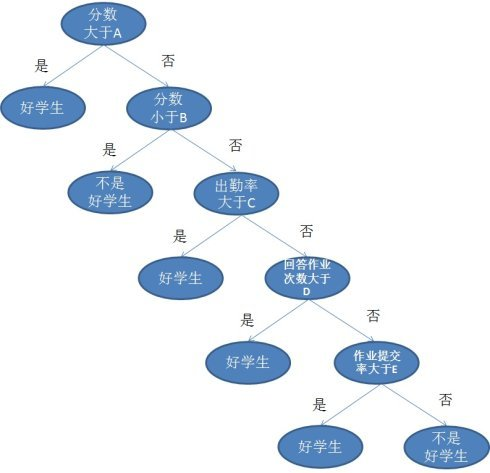
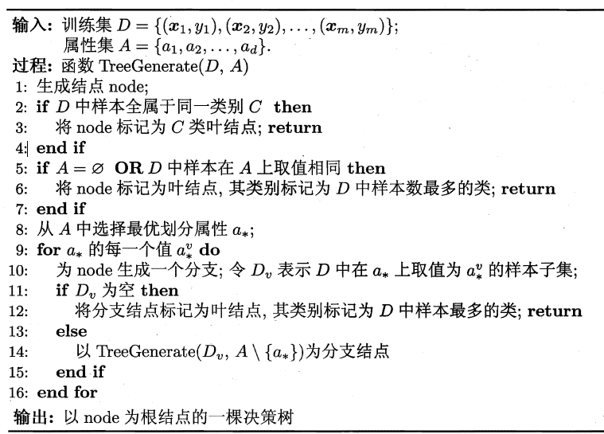
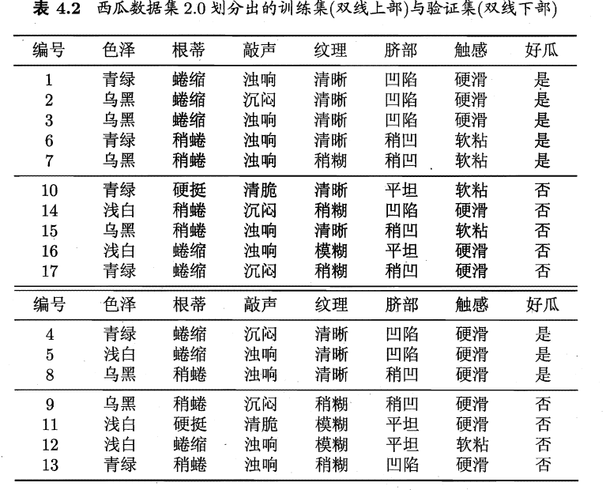
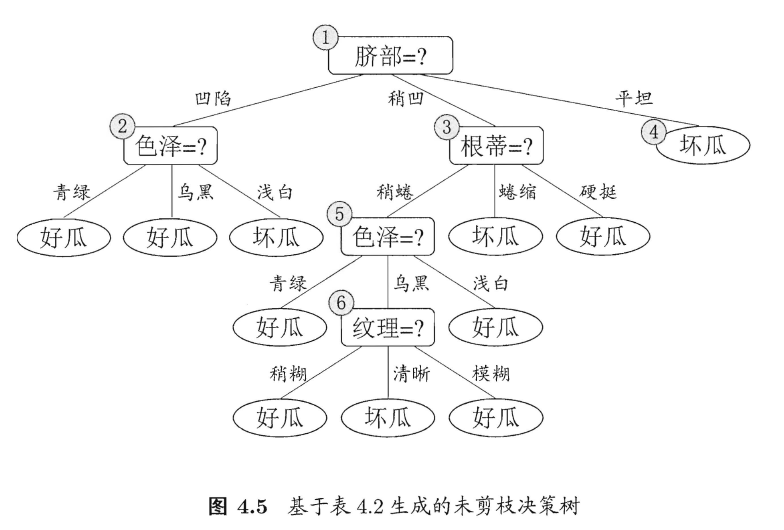
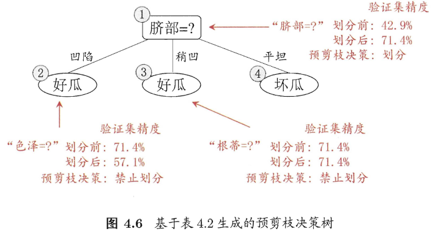
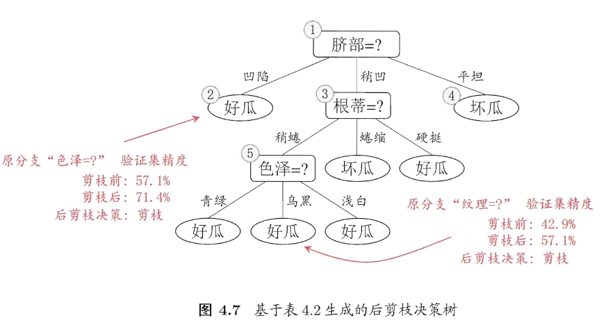
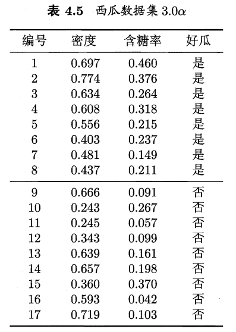
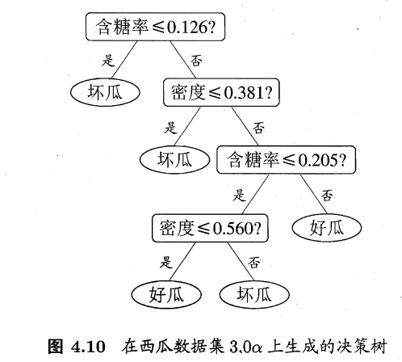
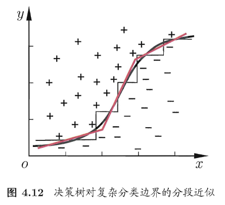
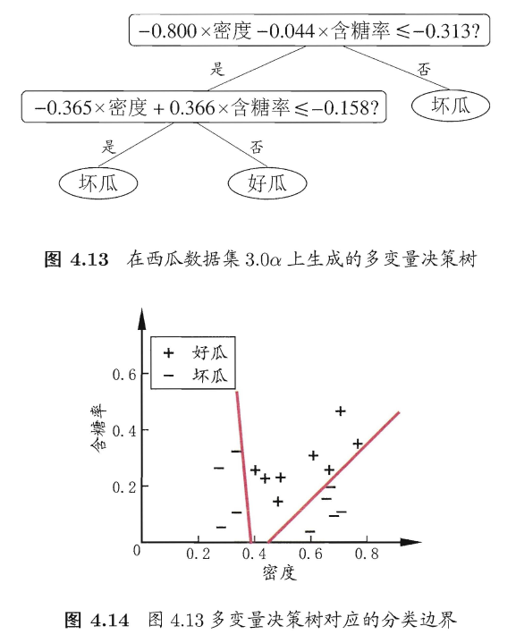

# 一、基本定义
1. 一棵决策树包含一个根结点、若干个内部结点和若干个叶结点
2. 叶结点对应于决策结果，其他每个结点则对应于一个属性测试
3. 每个结点包含的样本集合根据属性测试的结果被划分到子结点中;根结点包含样本全集 
4. 算法： 
   1. 当前结点包含的样本全属于同一类别，无需划分; 
   2. 当前属性集为空，或是所有样本在所有属性上取值相同，无法划分
   3. 当前结点包含的样本集合为空，不能划分.
   4. 决策树学习的关键是第8行，即如何选择最优划分属性。我们在第二部分介绍不同的划分选择
   5. 当决策树在分类时，样例最多的类不唯一，那么可任选其一

# 二、划分选择
1. 纯度：结点包含的样本归属于同意类别的概率
2. 决策树要找到最优化分属性，选择哪个属性的哪个值作为划分阈值尤为重要。信息熵是一个很好的视角
3. 信息熵：是度量样本集合纯度最常用的一种指标
   1. 假定当前样本集合D中第k类样本所占的比例为$p_k$，（$k=1,2,...,|\gamma|$）则D的信息熵定义为： $Ent(D)=-\sum_{k=1}^{|\gamma|}p_klog_2p_k$，$Ent(D)$值越小，D的纯度越高
4. 信息增熵
   1. 假设离散属性a有V个可能的取值$\{a^1,..,a^V\}$，划分时会产生V个分支结点。其中第v个分支结点包含了D中所有在属性a上取值为$a^v$的样本记为$D^v$
   2. 每个结点的样本数可能不一样，所以我们应该给结点赋权重$|D^v|/|D|$
   3. 于是可计算出用属性α 对样本集D 进行划分所获得的"信息增益"：(例题见书p75)
      1. $Gain(D,a)=Ent(D)-\sum^V_{v=1}\frac{|D^v|}{|D|}Ent(D^v)$
      2.  信息增益越大，则意味着使周属性α 来进行划分所获得的"纯度提升"越大
      3.  我们可以使用信息增熵划分属性选择，即在"一、4.算法"部分的第8行写$a_*=arg \max \limits_{a \in A} Gain(D,a)$
      4.  ID3决策树使用了信息增益这个划分方法
5. 增益率
   1. 信息增益准则对可取值数目较多的属性有所偏好。因为如果取值很多，那么对应的分类中样本数量很少，纯度也自然会很高
   2. 为减少信息增益这种偏好的不良影响，我们引入增益率（C4.5决策树算法）
   3. 增益率是一个对取值数目较少的属性有偏好的指标
   4. $Gain_ratio(D,a)=\frac{Gain(D,a)}{IV(a)}$，其中$IV(a)=-\sum^V_{v=1}\frac{|D^v|}{|D|}log_2\frac{|D^v|}{|D|}$
   5. IV(a)被称为属性a的固有值，a的取值越多，IV(a)越大
   6. C4.5：没有直接使用增益率，而是先从候选划分属性中找出信息增益高于平均水平的属性，再从中选择增益率最高的.
6. 基尼指数：CART决策树使用的算法
   1. 假定当前样本集合D中第k类样本所占的比例为$p_k$，$Gini(D)=\sum^{|\gamma|}_{k=1}\sum_{k' \neq k}p_kp_k'=1-\sum^{|\gamma|}_{k=1}p_k^2$
   2. Gini(D) 反映了从数据集D中随机抽取两个样本，其类别标记不一致的概率。因此，Gini(D) 越小，则数据集D的纯度越高
   3. 属性a的基尼指数：$Gini_index(D,a)=\sum^V_{v=1}\frac{|D^v|}{|D|}Gini(D^v)$
   4. 划分算法：$a_*=arg \min \limits_{a \in A} Gini_index(D,a)$

# 三、剪枝：决策树学习算法对付"过拟合"的主要手段
1. 在决策树学习中，为了尽可能正确分类训练样本，结点划分过程将不断重复，有时会造成决策树分支过多，这时就可能因训练样本学得"太好"了，以致于把训练集自身
的一些特点当作所有数据都具有的一般性质而导致过拟合.
2. 示例数据，双线下为验证集，双线上为训练集：  
3. 预剪枝
   1. 在决策树生成过程中，对每个结点在划分前先进行估计，若当前结点的划分不能带来决策树泛化性能提升，则停止划分并将当前结点标记为叶结点
   2. 解释
      1. 当我们把根结点作为叶节点（即不分类），其类别标记为训练样例数最多的类别。好瓜坏瓜数目一样多，那么我们选择“好瓜”作为label，验证集经过验证，发现正确率只有42.9%
      2. 用属性“脐部”划分，{4,5,8,11,12}被分类正确，正确率改善为71.4%，那么OK
      3. 决策树算法应该对结点②进行划分，基于信息增益准则将挑选出划分属性"色泽"。使用"色泽"划分后，编号为{5}的验证集样本分类结果会由正确转为错误，使得验证集精度下降为57.1%。因此我们把图4.5中的2结点的分叉进行剪枝
      4. 最后，原树的剪枝结果如下： 
   3. 欠拟合风险：，有些分支的当前划分虽不能提升泛化性能、甚至可能导致泛化性能暂时下降。但在其基础上进行的后续划分却有可能导致性能显著提高;预剪枝基于"贪心"本质禁止这些分支展开
4. 后剪枝
   1. 先从训练集生成一棵完整的决策树，然后自底向上地对非叶结点进行考察，若将该结点对应的子树替换为叶结点能带来决策树泛化性能提升，则将该子树替换为叶结点。
   2. 解释
      1. 图4.5中的树，分类性能为42.9%
      2. 先考察结点6，若将其领衔的分支剪除，则相当于把⑤替换为叶结点.替换后的叶结点包含编号为{7, 15} 的训练样本，于是，该叶结点的类别标记为"好瓜"，此时决策树的验证集精度提高至57.1%.，后剪枝策略决定剪枝
      3. 依次类推，可得剪枝后的树。分类准确率可达71.4%： 
   3. 欠拟合风险很小，泛化性好，但是时间开销巨大

# 四、属性为连续值时的决策树
1. 最朴素的思想就是把连续值离散化（划分区间）
2. 二分法：C4.5决策树采用的机制
   1. 给定样本集D 和连续属性α，假定α在D上出现了n个不同的取值，将这些值从小到大进行排序，记为$\{a^1,a^2,...,a^n\}$。基于划分点t可将D分为子集$D^-_t$和$D^+_t$，前者包含的是a取值小于t的样本，后者是大于t的样本
   2. t一般取中位数
   3. 信息增益的计算（关于样本集D基于划分点t二分后的信息增益）：$Gain(D,a)=\max \limits_{t \in T_a}Gain(D,a,t)=\max \limits_{t \in T_a}Ent(D)-\sum \limits_{\lambda \in \{-,+\}}\frac{|D_t^{\lambda}|}{|D|}Ent(D_t^{\lambda})$
# 五、缺失值处理
1. 给定训练集D和属性a，令$\tilde{D}$表示D中在属性a上没有缺失值的样本子集。假定a有V个取值$\{a^1,a^2,...,a^V\}$，令$\tilde{D^v}$表示$\tilde{D}$中在属性a上取值为$a^v$的样本子集。$\tilde{D}_k$表示$\tilde{D}$中属于第k类（$k=1,2,...,|\gamma|$）的样本子集
2. 如何在属性值缺失的情况下进行划分属性选择?
   1. 假定每个样本$\bold{x}$有权重$w_{\bold{x}}$
   2. 属性a上没有缺失值的样本占总样本的比例：$\rho=\frac{\sum_{\bold{x} \in \tilde{D}}w_{\bold{x}}}{\sum_{\bold{x} \in D}w_{\bold{x}}}$
   3. 在a属性无缺失值的样本中k类所占的比重：$\tilde{p_k}=\frac{\sum_{\bold{x} \in \tilde{D_k}}w_{\bold{x}}}{\sum_{\bold{x} \in D}w_{\bold{x}}}$，($1 \leq k \leq |\gamma|$)
   4. 属性a无缺失值样本中属性a取值为$a^v$的比例$\tilde{r_v}=\frac{\sum_{\bold{x} \in \tilde{D^v}}w_{\bold{x}}}{\sum_{\bold{x} \in D}w_{\bold{x}}}$,($1 \leq k \leq |V|$)
   5. $\sum^{|\gamma|}_{k=1}\tilde{p_k}=\sum^V_{v=1}\tilde{r_v}=1$
   6. $Gain(D,a)=\rho \times Gain(\tilde{D},a)=\rho \times (Ent(\tilde{D})-\sum^V_{v=1}\tilde{r_v}Ent(\tilde{D^v}))$，其中，$Ent(\tilde{D})=-\sum^{|\gamma|}_{k=1}\tilde{p_k}log_2\tilde{p_k}$
   7. 我们根据上述计算出来的信息增益决定这个有缺失值的属性是否值得划分
3. 给定划分属性，若样本在该属性上的值缺失，如何对样本进行划分?
   1. 以下方法为C4.5的经典算法
   2. 若样本$\bold{x}$在划分属性a上的取值己知，则将z划入与其取值对应的子结点，且样本权值在于结点中保持为$w_{\bold{x}}$
   3. 若样本$\bold{x}$在划分属性a上的取值未知，则将$\bold{x}$同时划入所有子结点,且样本权值在与属性值$a^v$对应的子结点中调整为$\tilde{r}_v*w_{\bold{x}}$

# 六、多变量决策树
1. 若我们把每个属性视为坐标空间中的一个坐标轴，则d个属性描述的样本就对应了d维空间中的一个数据点，对样本分类则意味着在这个坐标空间中寻找不同类样本之间的分类边界
2. 决策树所形成的分类边界有一个明显的特点:**轴平行**，即它的分类边界由若干个与坐标轴平行的分段组成.
3. 例子：
   1. 数据集： 
   2. 形成的决策树： 
   3. 分类边界的每一段都是与坐标轴平行的，这样的分类边界使得学习结果有较好的可解释性，因为每一段划分都直接对应了某个属性的取值
   4. 但是如果真实分类边界较为复杂的时候，我们要使用多段划分，这使得决策树变得复杂： 
      1. 若能使用斜的划分边界，如图中红色线段所示，则决策树模型将大为简化
      2. **多变量决策树** (multivariate decision tree) 就是能实现这样的"斜划分"甚至更复杂划分的决策树
4. 多变量决策树
   1. 每个非叶结点是一个形如$\sum^d_{i=1}w_ia_i=t$的线性分类器。$w_i$为属性$a_i$的权重，它和t是学习器通过结点所含的样本集和属性集学习得到
   2. 在多变量决策树的学习过程中，不是为每个非叶结点寻找一个最优划分属性，而是试图建立一个合适的线性分类器
   3. 例如对西瓜数据3.0a，可以构建多变量决策树： 