# 一、神经元模型
1. 神经网络中最基本的成分是神经元(neuron)模型
2. 在生物神经网络中，每个神经元与其他神经元相连，当它"兴奋"时，就会向相连的神经元发送化学物质，从而改变这些神经元内的电位;如果某神经元的电位超过了一个"阔值" (threshold) ， 那么它就会被激活，即"兴奋"起来，向其他神经元发送化学物质
3. "M-P神经元模型"
   1. 神经元接收到来自n个其他神经元传递过来的输入信号，这些输入信号通过带权重的连接(connection)进行传递
   2. 神经元接收到的总输入值将与神经元的阀值进行比较，然后通过"激活函数" (activation function) 处理以产生神经元的输出： 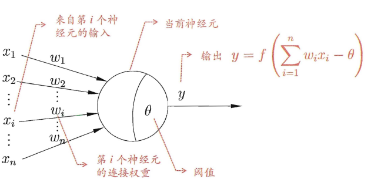
   3. 激活函数：
      1. 理想的激活函数：阶跃函数。它将输入值映射为输出值“0”或“1”，1对应神经元兴奋，0对应神经元抑制。但是这种函数不连续也不光滑。实践中常用Sigmoid
      2. Sigmoid：挤压函数。它把可能在较大范围内变化的输入值挤压到(0,1) 输出值范围内 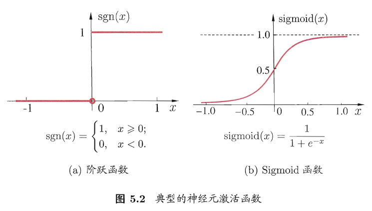
   4. 把许多个这样的神经元按-定的层次结构连接起来，就得到了神经网络
   5. 我们只需将一个神经网络视为包含了许多参数的数学模型，这个模型是若干个函数，例如$y_j=f(\sum_i w_ix_i-\theta_j)$。
      1. 10个神经元两两连接，则有100个参数。90个连接权和10个阈值

# 二、感知机与多层网络
1. 超平面
   1. 超平面是n维欧氏空间中余维度等于一的线性子空间，也就是必须是(n-1)维度
   2. 比如二维空间，一条线是一维的，他把平面分成两块
   3. 法向量，也就是我们的权重向量，垂直于超平面
   4. $\bold{w}^T\bold{x}-\theta=0$的推导
      1. 有超平面向量$\bold{x}$和其法向量$\bold{w}$，则有$\bold{w}^T\bold{x}=0$
      2. 超平面向上平移经过$\bold{x'}$
      3. 因为$\bold{w}$和$\bold{x'}$都在超平面上，所以有$(\bold{x}-\bold{x'})\bold{w}=0$，即$\bold{w}\bold{x}=\bold{w'}\bold{x}=b$
   5. 数据线性可分 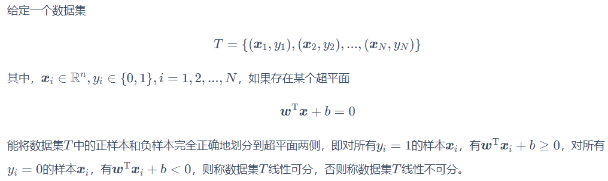
   6. 感知机只能解决线性可分的问题
2. 感知机(Perceptron) 由两层神经元组成，输入层接收外界输入信号后传递给输出层，输出层是M-P 神经元，亦称"阈值逻辑单元"(threshold logic unit) 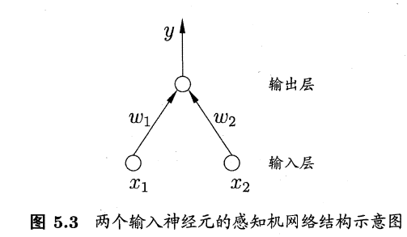
   1. 假定神经元为$y=f(\sum_i w_ix_i-\theta)=f(\bold{w}^T\bold{x}-\theta)$
   2. $\bold{w}^T\bold{x}-\theta=0$为n维空间中的一个超平面
   3. f一般为符号函数： 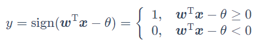
   4. 学习策略：
      1. 感知机的学习目标是求得能对数据集中的正负样本完全正确划分的分离超平面，即给出最良好的权重参数
      2. 损失函数：
         1. 因为y只有0或1这两种取值。当$\bold{w}^T\bold{x}-\theta \geq 0$，$\hat{y}=1$。无论y是否是1，都有$(\hat{y}-y)(\bold{w}^T\bold{x}-\theta) \geq 0$
         2. 当$\bold{w}^T\bold{x}-\theta \leq 0$，$\hat{y}=0$。无论y是否是0，都有$(\hat{y}-y)(\bold{w}^T\bold{x}-\theta) \geq 0$
         3. 因此给出损失函数$L(\bold{w}, \theta)=\sum \limits_{\bold{x} \in M} (\hat{y}-y)(\bold{w}^T\bold{x}-\theta)$
         4. 此损失函数是非负的。如果没有误分类点，损失函数值是0。而且，误分类点越少，误分类点离超平面越近，损失函数值就越小。这个函数关于$\bold{w},\theta$连续可导
      3. 最优化目标
         1. 给定数据集$T={(\bold{x}_i,y_i)},(i=1,...,n)$
         2. 最小化损失函数：
            1. $\min \limits_{\bold{w},\theta} L(\bold{w}, \theta)= \min \limits_{\bold{w},\theta} \sum \limits_{\bold{x_i} \in M} (\hat{y_i}-y_i)(\bold{w}^T\bold{x_i}-\theta)$
         3. 可以把阈值部分视为$\theta x_{n+1}$，其中$x_{n+1}=-1.0$。阈值可以视为第n+1个权重，此时转化为$\min \limits_{\bold{w}}L(\bold{x}) =\min \limits_{\bold{w}} \sum \limits_{\bold{x_i} \in M} (\hat{y_i}-y_i)(\bold{w}^T\bold{x_i}), (i=1,...,n+1)$
            1. 假设误分类样本集合M固定，可得损失函数的梯度（即对权重求导）：$\nabla_{\bold{w}} L(\bold{w})=\min \limits_{\bold{w}} \sum \limits_{\bold{x_i} \in M} (\hat{y_i}-y_i)\bold{x_i}$
            2. 我们需要调整权重$\bold{w}$，以尽可能使分类后有$\nabla_{\bold{w}} L(\bold{w})=0$
            3. 随机梯度下降：极小化过程中不是一次使所有误分类点梯度下降，而是一次随机选取一个误分类点使其梯度下降：$w_i \leftarrow w_i + \triangle w$，其中$\triangle w_i = \eta(y-\hat{y})x_i$。$\eta \in (0,1)$，为学习率。主要用来控制算法的步长
   5. 感知机的缺点：
      1. 感知机只有输出层神经元进行激活函数处理，即只拥有层功能神经元(functionalneuron) ，其学习能力非常有限，**他只能解决线性可分问题**。非线性可分问题，会导致权重的震荡，从而无法求取稳定解
      2. 因此，在逻辑判断中，感知机解决不了异或问题。如下面的几个例子
         1. and 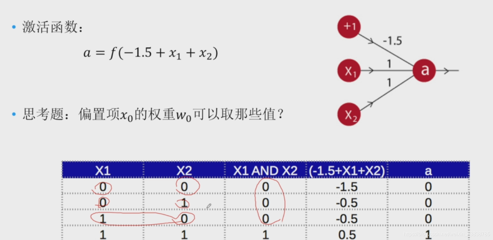
         2. or 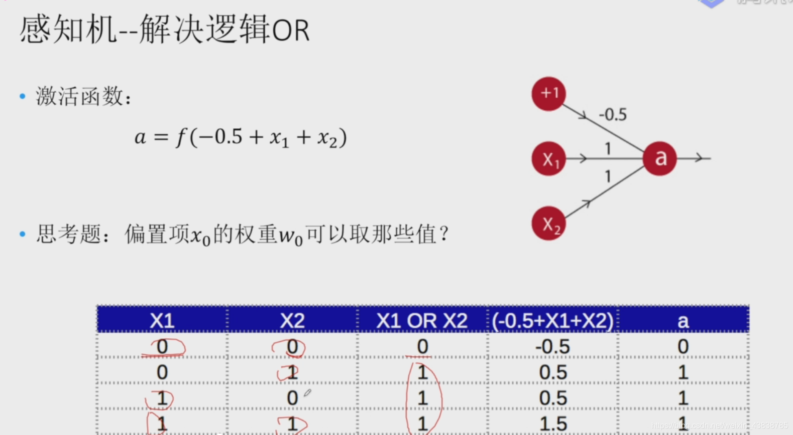
         3. not 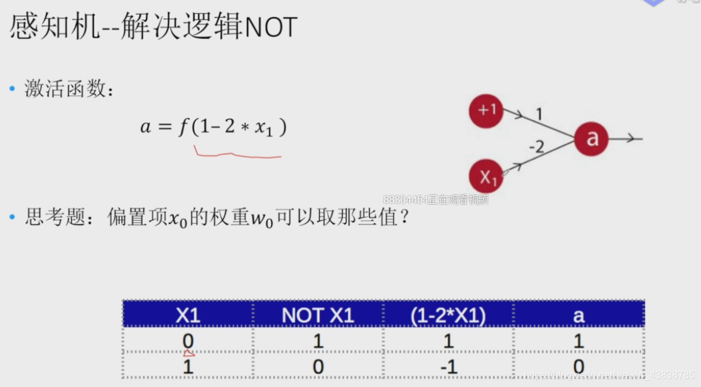
         4. 异或 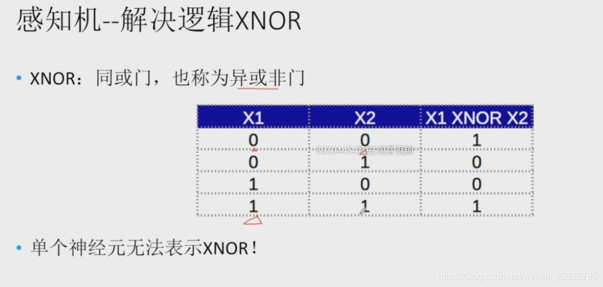
         5. 超平面分析 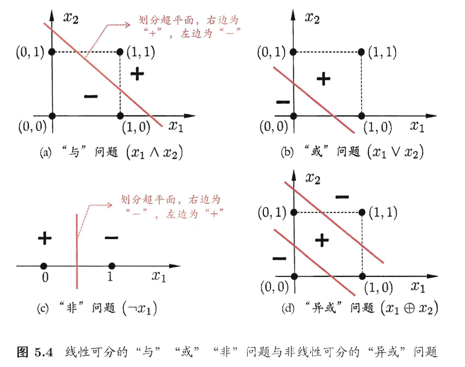
      3. 
3. 要解决非线性可分问题，需考虑使用多层功能神经元
   1. 两层感知机 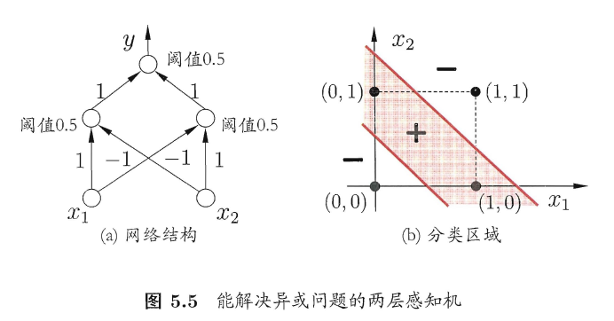
      1. 输出层与输入居之间的一层神经元，被称为隐居或隐含层(hidden layer)
      2. 隐含层和输出层神经元都是拥有激活函数的功能神经元
   2. 多层前馈神经网络：最常见 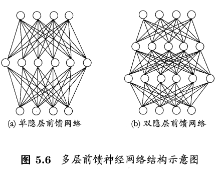
      1. 定义：每层神经元与下层神经元全互连，神经元之间不存在同层连接， 也不存在跨层连接
      2. 输入层神经元接收外界输入，隐层与输出层神经元对信弓进行加工，最终结果由输出层神经元输出。
      3. 输入层神经元仅是接受输入，不进行函数处理，隐层与输出层包含功能神经元.
      4. 只要包含隐层，就可以说是多层网络
      5. 神经网络的学习过程，就是根据训练数据来调整神经元之间的"连接权" (connection weight) 以及每个功能神经元的阑值;

# 三、误差逆传播算法（BP算法）
1. 简单的感知机算法无法适应多层神经网络，经常使用的是BP算法
2. 有数据集：$D={(\bold{x_i,y_i})}, x_i \in R^d, y_i \in R^l$。
3. 给定一个神经网络，拥有d个输入神经元，l个输出神经元，q个隐层神经元的多层前馈网络结构。我们假设激活函数为Sigmoid函数
   1. 输出层第j个神经元的阈值记为$\theta_j$，隐层的第h个神经元的阈值用$\gamma_h$表示
   2. 输入层第i个神经元和隐层第h个神经元连接权$v_{ih}$，隐层第h个神经元与输出层第j 个神经元之间的连接权为$w_{hj}$
   3. 隐层第h个神经元接收到的输入为$\alpha_h=\sum^d_{i=1}v_{ih}x_i$
   4. 输出层第j个神经元收到的输入为$\beta_j=\sum_{h=1}^qw_{hj}b_h$，其中$b_h$为隐层第h个神经元的输出 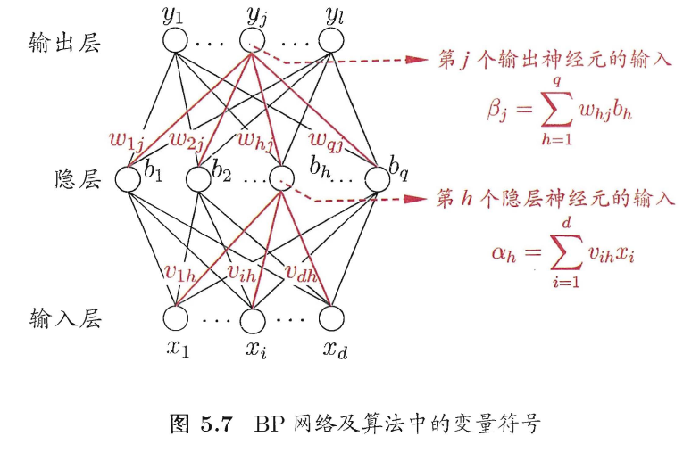
4. 神经网络输出为$\hat{\bold{y}_k}=(\hat{y}_1^k,...,\hat{y}_l^k)$，$\hat{y}_j^k=f(\beta_j-\theta_j)$
5. 定义均方误差：$E_k=\frac{1}{2}\sum_j(\hat{y}^k_j-y^k_j)^2$。这里$\frac{1}{2}$主要是求导时便于消除
6. 需要确定的参数数量：
   1. 输入层和隐层的链接：dq
   2. 输出层和隐层的链接：lq
   3. 隐层神经元的阈值：l
   4. 输出层阈值：q
7. 参数的更新：假设v是任意一个参数$v \leftarrow v +\triangle v$
8. 梯度下降：优化均方误差
   1. $\triangle w_{hj}=-\eta \frac{\partial E_k}{\partial w_{hj}}=\eta g_jb_h$
      1. $\frac{\partial E_k}{\partial w_{hj}}=\frac{\partial E_k}{\partial \hat{y}^k_j}·\frac{\partial \hat{y}^k_j}{\partial \beta_j}·\frac{\partial \beta_j}{\partial w_{hj}}$。设$\frac{\partial \beta_j}{\partial w_{hj}}=b_h$
      2. Sigmoid函数有一个很好的性质$f'(x)=f(x)(1-f(x))$,因此有$g_j=-\frac{\partial E_k}{\partial \hat{y}^k_j}·\frac{\partial \hat{y}^k_j}{\partial \beta_j}=-(\hat{y}^k_j-y^k_j)f'(\beta_j-\theta_j)=-(\hat{y}^k_j-y^k_j)f(\beta_j-\theta_j)(1-f(\beta_j-\theta_j))=-(\hat{y}^k_j-y^k_j)\hat{y}^k_j(1-\hat{y}^k_j)$
   2. $\triangle \theta_j = -\eta g_j$： 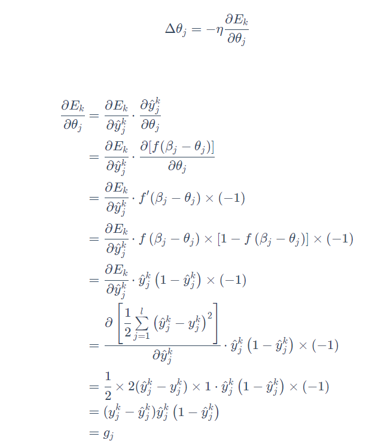
   3. $\triangle v_{ih} = \eta e_hx_i$ 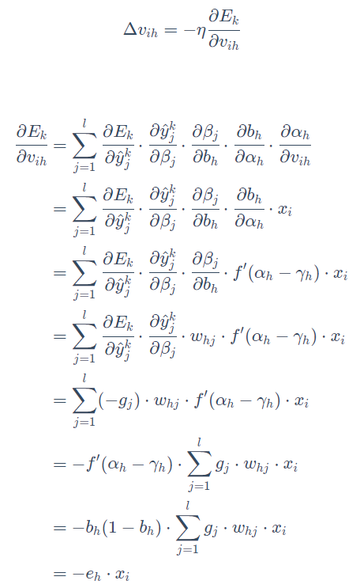
   4. $\triangle \gamma_{h} = -\eta e_h$ 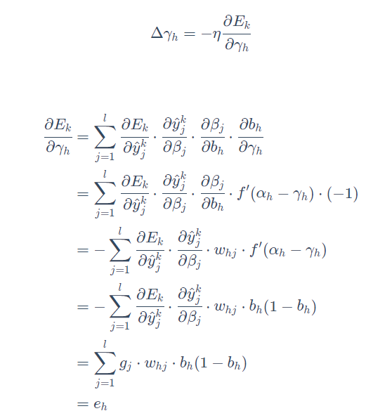
   5. $\eta$过小会导致收敛速度过慢，但是太大会导致数据震荡。不同的学习率下求出的最值未必相同
9. 标准BP算法的流程： 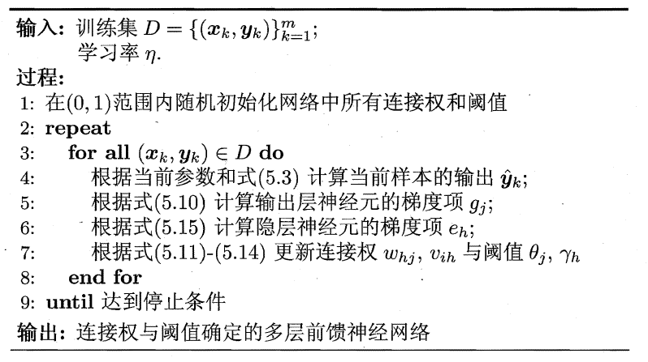
   1.  (5.10)指的是$\triangle w_{hj}=-\eta \frac{\partial E_k}{\partial w_{hj}}=\eta g_jb_h$中给出的$g_j$
   2.  (5.15)指的是在$\triangle \gamma_{h} = -\eta e_h$部分求出的$e_h$表达式
   3.  (5.11)~(5.14)指的分别是如下公式： 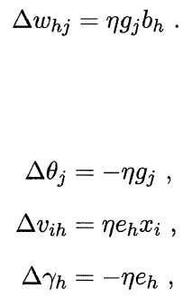
   4.  最小化目标：最小化均方误差目标$min E_k$
10. 累积BP算法
    1.  最小化目标：累积均方误差最小化$min E=min \frac{1}{m}\sum^m_{k=1}E_k$
    2.  它在i卖取整个训练集D 一遍后才对参数进行更新，其参数更新的频率低得多.但在很多任务中，累积误差下降到一定程度之后，进一步下降会非常缓慢，这时标准BP往往会更快获得较好的解，尤其是在训练集D非常大时更明显
    3.  标准BP 算法每次更新只针对单个样例，参数更新得非常频繁，而且对不同样例进行更新的效果可能出现"抵消"现象。因此，为了达到同样的累积误差极小点，标准BP算法往往需进行更多次数的迭代
11. 试错法：只需一个包含足够多神经元的隐层，多层前馈网络就能以任意精度逼近任意复杂度的连续函数。但是缺乏理论让我们直接求出神经元个数，所以我们一般进行试错
12. 过拟合：BP网络强大的表示能力会使其经常遇见。常见有两种策略
    1.  早停：将数据分成训练集和验证集，训练集用来计算梯度、更新连接权和阈值。验证集用来估计误差，若训练集误差降低但验证集误差升高，则停止训练，同时返回具有最小验证集误差的连接权和阈值。
    2.  正则化：误差目标函数（即均方误差）中增加一个用于描述网络复杂度的部分。比如我们让$w_i$表示连接权和阈值，那么累积误差函数变为：$E=\lambda \frac{1}{m}\sum^m_{k=1}E_k+(1-\lambda)\sum_iw_i^2$。增加连接权与闵值平方和这一项后，训练过程将会偏好比较小的连接权和阈值，使网络输出更加"光滑"从而对过拟合有所缓解

# 四、全局最小和局部极小
1. 局部极小解：
   1. 有误差$E(\bold{w},\theta)$，对于$\bold{w^*}$和$\theta^*$如果存在$\epsilon > 0$使得$\forall (\bold{w},\theta)\in \{(\bold{w},\theta)|\parallel (\bold{w},\theta)-(\bold{w}^*,\theta^*) \parallel \leq \epsilon\}$，都有$E(\bold{w},\theta) \geq E(\bold{w^*},\theta^*)$，那么我们称$(\bold{w}^*,\theta^*)$为局部极小解
   2. 局部极小解是参数空间中的某个点，其邻域点的误差函数值均不小于该点的函数值
2. 全局最小解
   1. 如果对参数空间中的任意$(\bold{w},\theta)$都有$E(\bold{w},\theta) \geq E(\bold{w^*},\theta^*)$，则称$(\bold{w^*},\theta^*)$为全局最小解
   2. 是指参数空间中所有点的误差函数值均不小于该点的误差函数值
3. 参数空间内梯度为零的点，只要其误差函数值小于邻点的误差函数值，就是局部极小点;可能存在多个局部极小值，但是只有一个全局最小解
4. 全局最小，一定局部最小。我们寻找最小解希望是找到全局最小解
5. 使用梯度下降法，如果误差函数具有多个局部极小，则不能保证找到的解是全局最小
6. 跳出局部极小，寻找全局最小
   1. 以多组不同参数值初始化多个神经网络，按标准方法训练后，取其中误差最小的解作为最终参数
   2. 模拟退火：每一步都以一定的概率接受比当前解更差的结果。在每步迭代过程中，接受"次优解"的概率要随着时间的推移而逐渐降低，从而保证算法稳定
   3. 随机梯度下降：在计算梯度时加入了随机因素。于是，即便陷入局部极小点，它计算出的梯度仍可能不为零，这样就有机会跳出局部极小继续搜索
   4. 遗传算法

# 五、其他常见的神经网络
1. RBF(径向基函数)网络
   1. 一种单隐层前馈神经网络，它使用径向基函数作为隐层神经元激活函数，而输出层则是对隐层神经元输出的线性组合
   2. 假定输入d维向量$\bold{x}$，输出为实值，RBF网络表示为$\phi(\bold{x})=\sum^q_{i=1}w_i\rho(\bold{x},\bold{c}_i)$。
      1. q为隐层神经元个数，$w_i,\bold{c}_i$分别表示第i个隐层神经元对应的中心和权重
      2. $\rho(\bold{x},\bold{c}_i)$为径向基函数，一般定义为样本$\bold{x}$到数据中心$\bold{c}_i$之间欧氏距离的单调函数，常用的高斯径向基函数为$\rho(\bold{x},\bold{c}_i)=e^{-\beta_i \parallel \bold{x} - \bold{c}_i \parallel^2}$
   3. 训练算法：
      1. 确定神经元中心$\bold{c}_i$，常用的方式：随机采样、聚类
      2. 利用BP算法等来确定参数$\beta_i$和$w_i$
2. ART（自适应谐振理论）网络：常用的无监督学习策略
   1. 胜者通吃机制：网络的输出神经元相互竞争，每一时刻仅有一个竞争获胜的神经元被撤活，其他神经元的状态被抑制
   2. 该网络由比较层、识别层、识别阔值和重置模块构成
   3. 比较层负责接收输入样本，并将其传递给识别层神经元
   4. 识别层每个神经元对应一个模式类，神经元数目可在训练过程中动态增长以增加新的模式类。
   5. 接受比较层的输入后，识别层神经元会展开竞争。
      1. 计算输入向量与每个识别层神经元所对应的模式类的代表向量之间的距离，距离最小者胜
      2. 获胜神经元将向其他识别层神经元发送信号，抑制其撤活
      3. 若输入向量与获胜神经元所对应的代表向量之间的相似度大于识别阔值，则当前输入样本将被归为该代表向量所属类别，同时，网络连接权将会更新，使得以后在接收到相似输入样本时该模式类会计算出更大的相似度，从而使该获胜神经元有更大可能获胜
      4. 若相似度不大于识别阑值，则重置模块将在识别层增设一个新的神经元，其代表向量就设置为当前输入向量
   6. 识别阈值对ART网络精度有很大影响。当识别阔值较高，输入样本将会被分成比较多、比较精细的模式类。而如果识别闹值较低，则会产生比较少、比较粗略的模式类
   7. ART网络可以增量学习或在线学习
      1. 增量学习是指在学得模型后，再接收到训练样例时，仅需根据新样例对模型进行更新，不必重新训练整个模型，并且先前学得的有效信息不会被冲掉
      2. 在线学习是指每获得一个新样本就进行一次模型更新。在线学习是增量学习的特例
      3. ART网络很好缓解了竞争学习中“可塑性-稳定性困境”，找到了两者的平衡。
         1. 可塑性：神经网络要有学习新知识的能力
         2. 稳定性：神经网络在学习新知识时要保持对旧知识的记忆
3. SOM（自组织映射）网络：竞争学习型的无监督神经网络
   1. SOM网络能将高维输入数据映射到低维空间(通常为二维) ，同时保持输入数据在高维空间的拓扑结构，即将高维空间中相似的样本点映射到网络输出层中的邻近神经元 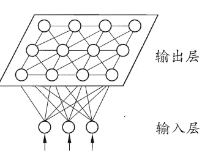
   2. 如图，SOM 网络中的输出层神经元以矩阵方式排列在二维空间中。每个神经元都拥有一个权向量，网络在接收输入向量后，将会确定输出层获胜神经元，它决定了该输入向量在低维空间中的位置
   3. SOM 的训练目标就是为每个输出层神经元找到合适的权向量，以达到保持拓扑结构的目的
   4. 训练过程：
      1. 在接收到一个训练样本后.每个输出层神经元会计算该样本与自身携带的权向量之间的距离，距离最近的神经元成为竞争获胜者，称为最佳匹配单元
      2. 最佳匹配单元及其邻近神经元的权向量将被调整，以使得这些权向量与当前输入样本的距离缩小。这个过程不断迭代，直至收敛
4. 级联相关网络
   1. 一般的神经网络模型通常假定网络结构是事先固定的，训练的目的是利用训练样本来确定合适的连接权、阈值等参数。
   2. 与此不同，结构自适应网络则将网络结构也当作学习的目标之一，并希望能在训练过程中找到最符合数据特点的网络结构。比如ART网络的隐层神经元数目需要增长，所以它也是一种结构自适应网络
   3. 级联相关网络是结构自适应网络的代表 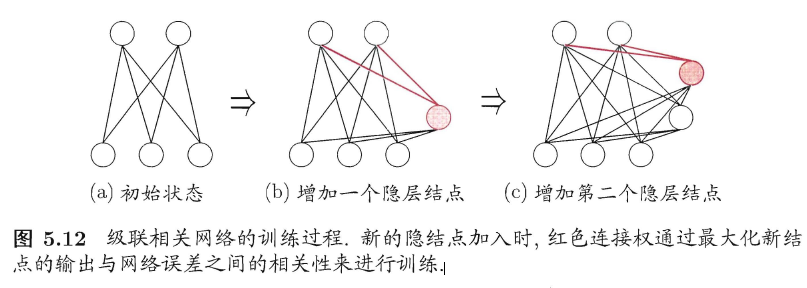
      1. 级联性：建立层次连接的层级结构
         1. 在开始训练时，网络只有输入层和输出层，处于最小拓扑结构
         2. 随着训练的进行，新的隐层神经元逐渐加入，从而创建起层级结构。当新的隐层神经元加入时，其输入端连接权值是冻结固定的
      2. 相关性：最大化新神经元的输出与网络的误差之间的相关性来训练相关的参数
      3. 优点：级联相关网络无需设置网络层数、隐层神经元数目，且训练速度较快
      4. 缺点：其在数据较小时易陷入过拟合.
5. Elamn网络：递归神经网络的代表
   1. 递归神经网络允许网络出现环形结构，，从而可让一些神经元的输出反馈回来作为输入信号。使得网络在t时刻的输出状态不仅与t时刻的输入有关，还与t-1时刻的网络状态有关，从而能处理与时间有关的动态变化
   2. Elman网络：隐层神经元经常使用Sigmod，网络训练使用推广的BP算法 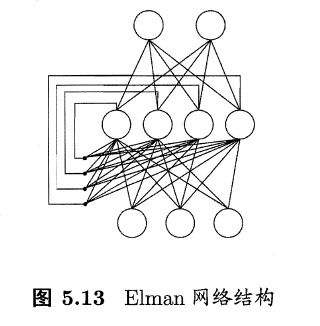
6. Boltzmann机
   1. 基于能量的模型：神经网络中有一类模型是为网络状态定义一个"能量" (energy) ，能量最小化时网络达到理想状态，而网络的训练就是在最小化这个能量函数.Boltzmann机是一个典型的代表
   2. Boltzmann机： 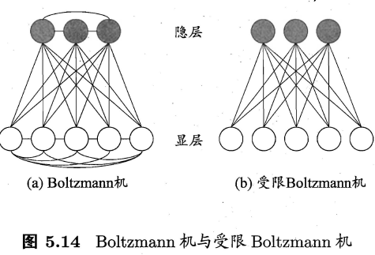
      1. 神经元分为两层:显层与隐层。显层用于表示数据的输入与输出，隐层则被理解为数据的内在表达
      2. 神经元都是布尔型的，只有0，1两种状态。0表示抑制，1表示激活
      3. 能量函数$E(v,h)=-v^T·w·h-\frac{1}{2}v^T·L·v-\frac{1}{2}h^T·j·h$
      4. 其中v表示显层结点，为$v={0,1}^D$；h为隐层结点，为$h={0,1}^P$；L表示v结点之间的相互连接，为一个$D\times D$的矩阵，对角线为0；j表示h结点之间的相互连接，为一个$P\times P$的矩阵，对角线为0；w表示v和h结点之间的相互连接，为一个$D\times P$的矩阵

# 六、深度学习
1. 训练数据的大幅增加则可降低过拟合风险，为深度学习出现创造了条件
2. 增加隐层的数目显然比增加隐层神经元的数目更有效，因为增加隐层数不仅增加了拥有激活函数的神经元数目，还增加了激活函数嵌套的层数。但是多隐层常常难以使用BP算法等经典算法训练，因为误差在多隐层内逆传播时，常常无法收敛
3. 深度学习的思想：通过多层处理，逐渐将初始的" 低层"特征表示转化为" 高层" 特征表示后，用"简单模型" 即可完成复杂的分类等学习任务。设计出好的特征非常重要，也就是特征工程
4. 无监督逐层训练是多隐层网络训练的有效手段
   1. 预训练：每次训练一层隐结点，训练时将上一层隐结点的输出作为输入，而本层隐结点的输出作为下一层隐结点的输入
   2. 微调：预训练完成后再用算法对整个网络进行训练，微调参数
   3. "预训练+微调"的做法可视为将大量参数分组，对每组先找到局部看来比较好的设置，然后再基于这些局部较优的结果联合起来远行全局寻优
5. 权共享：让一组神经元使用相同的连接权，比如CNN