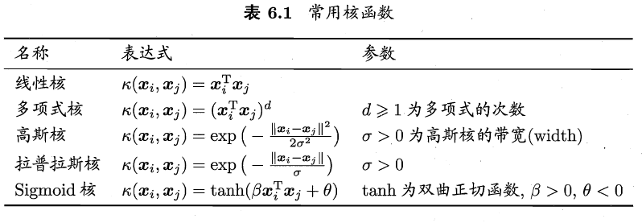
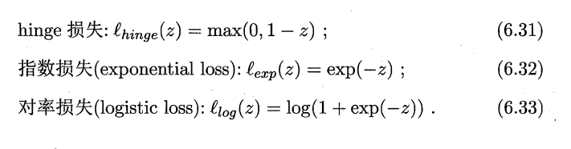

# 1.支持向量
1. 对于一个二分类样本数据集（$y_i \in \{-1,+1\}$），我们想要找到他的超平面$\bold{w^Tx}+b=0$，记为$(\bold{w},b)$。样本点$\bold{x}$到超平面距离为：$r=\frac{|\bold{w^Tx}+b|}{\parallel \bold{w} \parallel}$ 
2. 支持向量：两个类别分别距离超平面最近的2个点 
3. 间隔（margin）：两个异类支持向量到超平面的距离之和
4. 最优化任务：找到最大间隔 
   1. 如图所示，此时我们的间隔求出为$\gamma = \frac{2}{\parallel \bold{w} \parallel}$
   2. 一般而言，即使二分类任务label对应的不是0和1，我们也可以通过变化让他变成0和1： 
   3. 在本例中，我们假设$\parallel \bold{w} \parallel d=1$，因此有： ，两方程合并为$y_i(\bold{w}x_i+b)\leq 1$
   4. 此时有最优化方程： 。因为最优化目标只需要最小化$\parallel \bold{w} \parallel$，所以我们最优化可以转化为： 
   5. 这个就是支持向量机原型

# 2.对偶问题
1. 先对最优化问题使用拉格朗日乘数法： 
2. 对偶问题：可以解出$\bold{\alpha}$，然后可得$\bold{w}$和b  最后可得模型： 
   1. KKT条件：求解$\alpha$时的约束，也是拉格朗日乘子法本身的约束
      1. 基本原理：  对于(5)的解释：  当最优解$\bold{x}^*$在圈内，因为在$g(\bold{x})<0$的范围，此时没有约束，可以直接对$\partial f=0$求出最优解。但是拉格朗日乘子法要满足$\partial L=\partial f + \lambda\partial g=0$，所以应该有$\exist \lambda > 0，令\lambda\partial g=0$成立
      2. 因此在求解SVM的$\alpha$时，应当有KKT条件： 
   2. 求解对偶问题中的$\alpha$：SMO
      1. 基本思路：根据约束条件$\sum^m_{i=1}a_iy_i=0$，那么只要选取两个参数$\alpha_i和\alpha_j$，固定其他参数，对$\alpha_j$求极值，$\alpha_i$可以由$\alpha_j$表出。通过以下约束方程迭代  不断执行上述操作，直至参数收敛
      2. 如何选取$a_i$和$a_j$
         1. 先选取违背KKT条件程度最大的变量$a_i$
         2. 再选取使目标函数值减小最快的变量$a_j$。具体方法是使$a_i$和$a_j$对应的样本向量尽可能的最大
      3. 简化运算：此时改写约束条件$\sum^m_{i=1}a_iy_i=0$：$a_iy_i+a_jy_j=c，c=-\sum_{k \neq i,j}，a_i\geq 0，a_j \geq 0$。此时可以把优化目标(6.11)化为只有$a_i$一个变量的目标函数（因为其他变量被固定），此时约束也只有$a_i \geq 0$
3. 如何确定偏移量b：求解完$a_i$后如何确定b
   1. (6.9)告诉了我们$\bold{w}$的表达式
   2. 对于任何支持向量($\bold{x_s}$,y_s)都有$y_sf(\bold{x_s})=1$（因为支持向量都在$\bold{w^Tx}+b \leq -1或\bold{w^Tx}+b \geq 1$这两条线上）
   3. 因此有：$y_s(\sum \limits_{i \in S}a_iy_i\bold{x^T_ix_s}+b)=1，其中S=\{i|a_i > 0, i=1,2,...,m\}为所有支持向量的下标集$
   4. 现实中，为了保证鲁棒性，我们使用所有支持向量求解的平均值去反解b。
      1. 对于支持向量，有$y_s=\bold{w^Tx_s}+b$
      2. 对所有支持向量求和$\sum_{s \in S} y_s = \sum_{s \in S} (\bold{w^Tx_s}+b)$
      3. 反解b为 

# 3.核函数
1. 在现实任务中，原始样本空间内也许并不存在一个能正确划分两类样本的超平面，比如“异或”问题。对这样的问题，可将样本从原始空间映射到一个更高维的特征空间，使得样本在这个特征空间内线性可分。**如果原始空间维数有限，即属性数有限，那么我们一定可以找到一个可以让样本线性可分的高维特征空间**
2. 设$\phi(\bold{x})$为$\bold{x}$的高维映射，于是高维度中，超平面为：$f(\bold{x})=\bold{w^T\phi(x)}+b$，最优化问题为： 
3. 核函数
   1. 如何计算$\bold{\phi(x_i)^T\phi(x_j)}$是我们要克服的重点，因为他可能会使维数无穷大
   2. 我们假设有一个函数$\kappa(\bold{x_i,x_j})=\bold{\phi(x_i)^T\phi(x_j)}$，即他们可以将在原空间中计算的$\bold{x_i^Tx_j}$映射到高维度空间，这个$\kappa(·,·)$为核函数
   3. 核函数和核矩阵： 
      1. 对称函数的含义是$\kappa(x_i,x_j)=\kappa(x_j,x_i)$
      2. 这个函数为对称矩阵，因此一定是半正定的。
      3. 对于一个半正定核矩阵，总能找到一个与之对应的映射$\phi$
      4. 任何一个核函数都隐式地定义了一个称为"再生核希尔伯特空间"(RKHS)的特征空间
      5. 核函数的性质： 
   4. 核函数的选择：影响支持向量机的性能 

# 4. 软间隔和正则化
1. 在现实任务中往往很难确定合适的核函数使得训练样本在特征空间中线性可分，因此我们需要允许支持向量机出错，此时引入**软间隔**的概念
2. 软间隔：允许有的样本不满足$y_i(\bold{w^Tx_i}+b) \geq 1$，但应该保证最大化软间隔的同时，不满足约束的目标尽可能的少
3. 优化目标变为：即给原本二次项的优化目标加上了损失函数 
   1. 替代损失：01损失函数因为非凸，非连续，因此不太好求解，所以我们会使用替代损失函数： 
   2. 函数图像： 
4. 软间隔支持向量机
   1. 松弛变量($\epsilon_i$)：当约束条件为“≤”（“≥”）类型的线性规划问题，可在不等式左边加上（或者减去）一个非负的新变量，即可化为等式。这个新增的非负变量称为松弛变量（或剩余变量），也可统称为松弛变量。
   2. 从而改写最优化目标为： $\min \limits_{\bold{w,b,\epsilon_i}} \frac{1}{2}\parallel \bold{w} \parallel^2+C\sum_{i=1}^m\epsilon_i，其中损失函数l(z)=\epsilon_i$
   3. 此时拉格朗日方程也会发生改变，我们以hinge损失函数为例，最优化目标和拉格朗日函数分别为：$\min \limits_{\bold{w,b,\epsilon_i}} \frac{1}{2}\parallel \bold{w} \parallel^2+C\sum_{i=1}^m\epsilon_i$  。求解对偶问题： KKT条件更新为： 
   4. 软间隔可以视为我们给超平面了一些软性空间，只要在这个误差范围允许，就算对应的类别。如图，虽然红点不在虚线范围之外，但是如果我们给予超平面一些误差范围，这些点还是可以被二分的 
   5. 软间隔支持向量机的更一般形式： 
      1. $\Omega(f)$为结构风险，用于描述f的某些性质。描述了模型的目的，有助于削减假设空间。这个项也被称为正则化项。$L_p$范数是常用的正则化项。$L_2$范数倾向于让$\bold{w}$的分类取值更加均衡，即非零分量个数尽量稠密，而L1和L0范数则倾向于使$\bold{w}$的分类取值更加稀疏，即非零分量个数尽量少
      2. 第二项为经验风险，用于描述模型和数据的契合程度。C被称为正则化常数，用来平衡结构风险与经验风险

# 5. 支持向量回归（SVR）
1. 传统回归任务的损失函数是计算$f(x)$和真实值y的误差。但是SVR是假定一个误差容忍程度$\epsilon$，只有$f(x)$和真实值y的误差大于$\epsilon$，才会开始计算损失函数
2. 因此，SVR可以视为以$f(x)$为中心，构建了一个间隔为$2\epsilon$的间隔带，只要落在间隔带上的点，都可以视为正确预测： 
3. SVR：
   1. 优化目标: 
   2. 我们之所以引入$\xi_i,\hat{\xi}_i$，是因为我们认为$f(x)$两侧的松弛程度可以不同。即两边的点和各自边上的线优不同程度的浮动
   3. 引入拉格朗日乘子： 
      1. 求导，对原目标函数进行代换，得对偶问题，求解$a_i$ 
      2. KKT条件 
      3. 关于b的计算：根据KKT条件进行反推
         1. 根据KKT条件的第4条，$\xi_i或\hat{\xi}_i$不为0，那么$C=a_i或C=\hat{a}_i$
   4. 可得SVR的解为：  此时，可以引入核函数 
# 6. 核方法
1. 表示定理： 
2. 表示定理对损失函数没有限制，对正则化项$\Sigma$只要求单增。这种很小的约束给了核函数很大的应用空间
3. 基于核函数的学习方法，被称为核方法
4. 我们通过核化把线性学习器拓展为非线性学习器
5. 核线性判别分析：使用核函数把线性学习器拓展为非线性学习器
   1. 我们把线性函数映射到特征空间$F$，有$h(\bold{x})=\bold{w^T}\phi(\bold{x}$
   2. 根据线性分析内容，我们可以得出该线性分析的学习目标为： 
   3. 根据“表示定理”，我们假设表示定理中$l=J(\bold{w})，\Sigma =0$，因此有$\bold{w}=\sum_{i=1}^ma_i\phi(\bold{x_i})，h(\bold{x})=sum^m_{i=1}a_ik(\bold{x},\bold{x_i})$
   4. 核矩阵：  我们说明一下，假设此时仅有4个样本，其中第1和第3个样本的标记为0，第2和第4个样本的标记为1，那么此时：  
   5. 最后可以把目标函数转化为：$\max \limits_{\bold{a}}J(\bold{a})=\bold{\frac{a^TMa}{a^TNa}}$